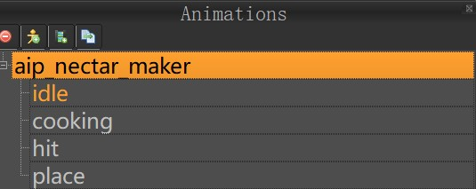
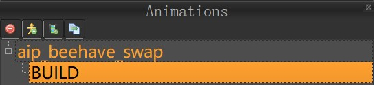

# 物品制作

# 场景中的物品

在 `exported` 文件夹下创建的你的物品子文件夹，如 `my_item`。使用 Mod Tools 的 Spriter 在该文件夹下创建同名文件 `my_item.scml` 项目。

接着创建对应的实体和动画：



其中，实体的名字为你的物品名字 `my_item`。另外动画场景有以下几个：

| 名称  | 描述           |
| ----- | -------------- |
| place | 建造动画       |
| idle  | 在界面上的动画 |
| hit   | 被攻击时的动画 |

绘制动画并保存后，启动饥荒联机版客户端。它会自动将文件导出成 `anim` 文件。
为了提升 mod 生成性能，将已经开发完成的物品从 `exported` 文件夹移动到 `exported_done` 中。

发布版本前，需要检测是否 `anim` 中已经有了所有来自 `exported` 和 `exported_done` 的物品对应的编译产物。

## 装备的物品

在 `exported` 中创建 `my_item_swap` 文件夹并且创建 spriter 文件。其中实体名称为 `my_item_swap`，动画为 `BUILD` （只能是这个名字）。



将需要人物握住的中心点拖到对应位置，右击覆盖默认中心点。保存退出。手持物品就有了。
其中需要注意的是，这里编译出来的图片缩放旋转都是无用的，只和原始图片相关。所以需要自己裁剪图片。

# 物品栏中的物品

物品栏的物品没有实体，所以只需要一个图片即可。在 `images/inventoryimages` 中创建一个 `my_item.xml`：

```xml
<Atlas>
    <Texture filename="my_item.tex" />
    <Elements>
        <Element name="my_item.tex" u1="0" u2="1" v1="0" v2="1" />
    </Elements>
</Atlas>
```

将一个 RBG-8 位带 Alpha 通道，尺寸为 2 的整次方倍的 png 图片 `my_item.png` 放入其中。启动饥荒后会自动编译成 tex 文件。

同理，如果开发完成。需要将 `images/inventoryimages` 中的图片迁移到 `images_done` 中避免额外的性能消耗。

# 对应的脚本

在 `modmain.lua` 中的 `PrefabFiles` 添加 `my_item`。并创建对应的 `scripts/prefebs/my_item.lua` 文件。然后照着一个文件写起来吧~